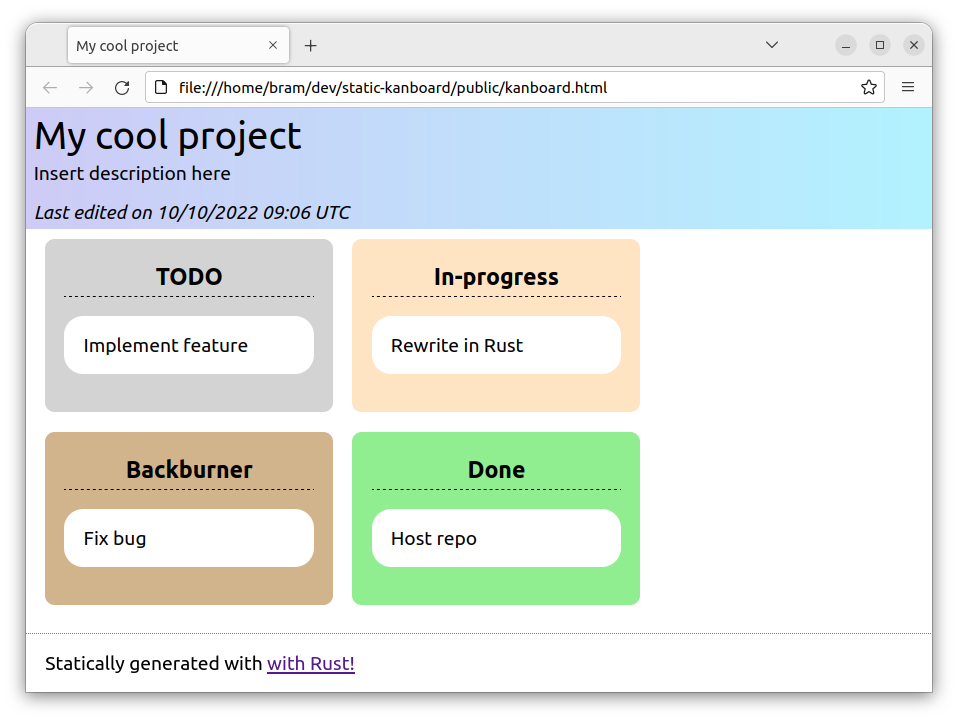

# Rustkan
A Rust program that exports a csv file to a **read-only** html **kanboard**, meant for spectators.

Can be easily hosted on services like Netlify.

## Installation 
- Clone this repo
- Have cargo and Rust installed.
- Run `sh install` *(check before running)*

## Usage
1. Initialize a new board
```console
rustkan init my_board 
```
2. Edit `config.toml` and `board.csv` in `my_board`

3. Export/regenerate the board
```console
rustkan export my_board
```
or
```
cd my_board
rustkan export
```

4. This will (re)generate `index.html` in the `my_board` directory. Edit `kanban.css` to your hearts content.

For advanced usage, view source.

## Preview


The page also adapts to mobile!
